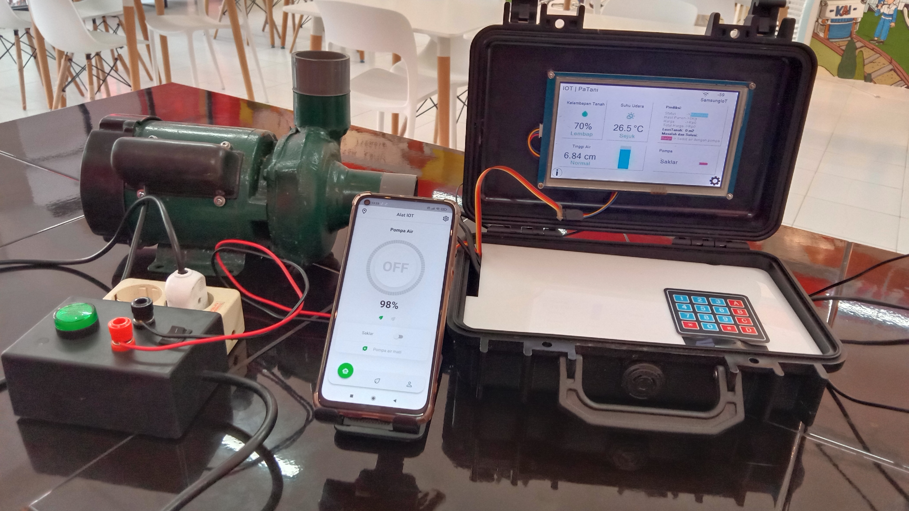

# SawahKita-IoT

SawahKita IoT Project

This is the updated version of Sawahku. I said that this is the updated version but actually it is entierly different things. The sensor is different, the program is different, even the MCU is different.

Some of the feature currently not available like store data to the eeprom, RTC, calculate fuzzy, etc. But most of the basic function is still usable.

tested board :
esp8266